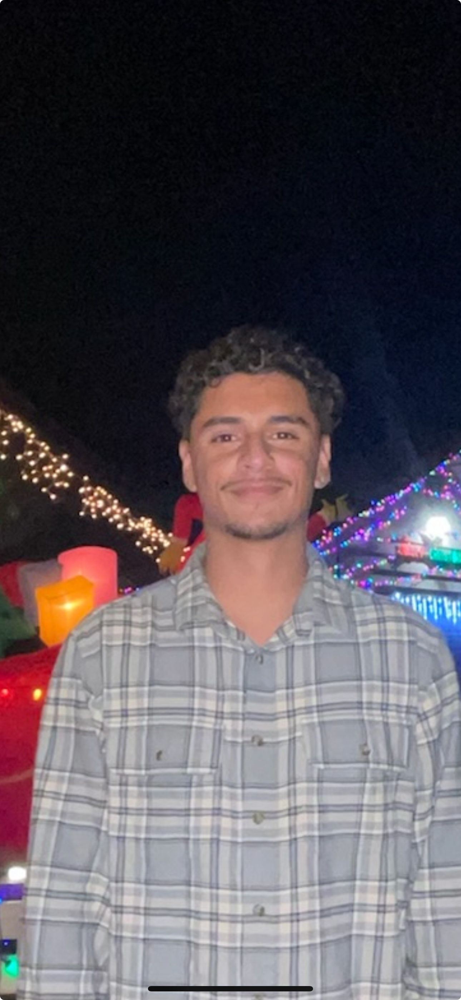

# David De Santiago

## Welcome to My User Page!

I'm a third-year Computer Engineering student at the University of California, San Diego, and I'm all about innovating and tackling complex challenges with technology.

 

### About Me
Born and raised in Los Angeles, I moved to San Diego to dive deeper into the tech world. I enjoy creating things that live on the web, whether that be websites, applications, or games.

### Education
- **University of California, San Diego**
  - B.S. in Computer Engineering, GPA: 3.2
  - Relevant Coursework: Data Structures, Object-Oriented Design, Software Tools and Techniques, Discrete Mathematics, Computer Organization and Systems Programming, Linear Algebra

### Personal Projects
- **Goldberg Device (Arduino)**:
  Designed a complex Rube Goldberg machine with an Arduino, honing my skills in electronics and project management.
  
- **Snake Game (Java)**:
  Implemented this classic game, adding different difficulty levels, high scores, and sound effects to enrich the user experience.
  
- **TicTacToe (Java Game)**:
  Developed an AI-powered TicTacToe game, pushing my understanding of AI programming and game theory.
  
- **Morse Translate (JavaScript Program)**:
  Crafted a JavaScript program that translates text into Morse code, enhancing my problem-solving abilities and coding expertise.

### Skills
- **Programming Languages**: Python, Java, C, JavaScript, C++
- **Interpersonal**: Team collaboration, leadership, effective communication
- **Technical**: Software development, critical thinking, hardware interfacing

### Achievements
- **Chancellor's Associates Scholars Program Scholarship**:
  Received this scholarship in recognition of academic excellence and potential for leadership.

### Organizations
- **IEEE**: As a member, I attend technical workshops and network with industry professionals.
- **Society of Hispanic Professional Engineers (SHPE)**: Collaborating with peers to enhance technical and leadership skills.
- **ECE Department (UCSD)**: Serving as a Scribe, I ensure that the details of every meeting are accurately recorded.

### Languages
- **English**: Native
- **Spanish**: Professional Proficiency

### Interests
I'm intrigued by AI, machine learning, robotics, cybersecurity, and game development. In my free time, I'm either working on a new tech project or diving into the latest developments in computer systems and circuits.

---

Let's connect! Reach out to me on [LinkedIn](https://www.linkedin.com/in/david-de-santiago-a485b4240) or send me an [email](mailto:ddesantiago@ucsd.edu).

Thank you for visiting my page, and I look forward to collaborating on exciting projects!
